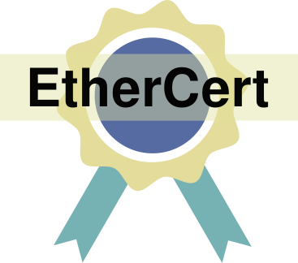
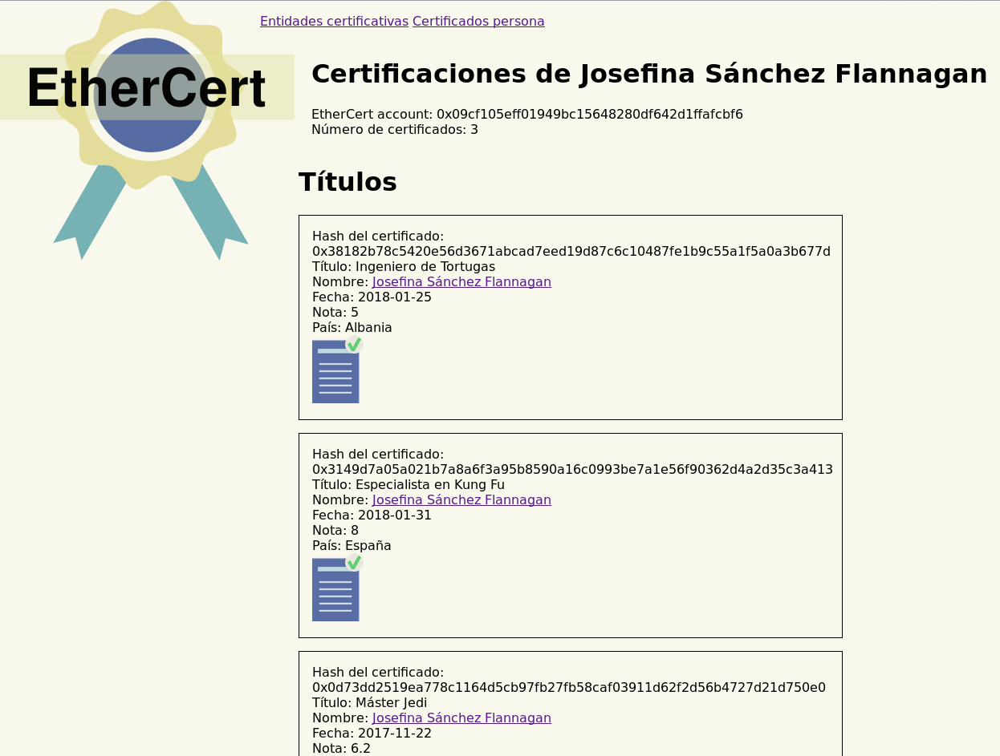

# EtherCert

Se trata de una aplicación basada en los Smart Contracts de la red Ethereum para gestionar la emisión y comprobación de certificados de formación de forma automática.

Esta aplicación fue el resultado de el hackathon [#dappeando](http://www.fundacionctic.org/ctic/actualidad/noticias/dappeando-el-21-de-octubre-inscribete-para-convertir-tus-ideas-en-aplicaciones-de-blockchain) organizado por el CTIC y la Escuela Politécnica de Ingeniería de Gijón que se desarrolló a lo largo del día 21 de octubre de 2017.

Me he permitido retocar el resultado para su presentación.

## Análisis
Trataré de exponer la idea general de la forma más sencilla posible, haciendo énfasis en los actores y escenarios típicos de uso, la ayuda de Luis Meijueiro en este punto fue muy reveladora.

Hay 3 tipos de actores posibles:
1. Estudiantes que cursan formaciones
2. Entidades que forman
3. Empresas que contratan

Las entidades expiden certificados a aquellos que completan los cursos. Estos certificados son luego añadidos a sus currículums y enviados a empresas. Estas comprueban la validez y autenticidad de éstos.

Esta aplicación permite que se haga de forma automática, la información es grabada en la blockchain de Ethereum a través de un Smart Contract.

Así los casos de uso serán:
  1. Expedición de certificados
      - Un estudiante completa su formación y la entidad dispone de esta facilidad.
      - El estudiante comunica su cuenta de Ethereum a la que expedir su título.
      - La entidad expide el certificado que atestigua la formación a través de la aplicación.
  2. Comprobación de certificados
      - Un estudiante envía su currículum a una empresa
      - La empresa comprueba la autenticidad de los títulos a través de la aplicación

## Diseño
El Smart Contract relacionará estudiantes, entidades de formación y certificados a los que me referiré respectivamente como **Persona**, **Entidad** y **Documento**.

Y tendrá que responder dos preguntas con respecto a los documentos (uso sintaxis pseudo Haskell, perdón si no se entiende).
1. ¿Este Documento certifica a esta Persona?, y si es cierto, ¿qué Entidad lo certifica?
  
  `Persona x Documento -> Maybe Entidad`
  
2. ¿Esta Entidad ha expedido este Documento?, y si es cierto, ¿a qué Persona ha sido expedida?
  
  `Entidad x Documento -> Maybe Persona`

Allí desarrollamos otro Smart Contract que gestionaba toda la colección de documentos emitidos, creo que esto no es necesario, por los casos de uso basta satisfacer esas dos preguntas.

## Implementación
Los documentos no han sido estandarizados, de todos modos, en la blockchain sólo se guarda una firma *hash* del documento. Es decir, puede guardarse cualquier cosa. Es una consideración razonable, la blockchain no es para almacenamiento, se desea grabar lo mínimo posible. El uso de la firma garantiza la autenticidad del documento en sí, y luego será responsable del receptor guardar una copia del original.

Por otro lado supongo que si se utilizara este sistema, los agentes implicados llegarían a un acuerdo sobre el formato de los documentos digitales para posteriores beneficios (como comprobación automática por otros programas) y también de este modo el campo es lo suficientemente general sin tomar partida en nada más que lo indispensable, de este modo podría extrapolarse a otros campos. En la aplicación de ejemplo se utiliza un único formato de documento en formato JSON.
Resumiendo
  * La autenticidad de los documentos se alcanza por el firmado que es almacenado en la blockchain
  * La blockchain proporciona las otras características, la relación entre los documentos y las cuentas que los reciben y los emiten.

### Tecnologías
Utiliza el lenguaje Solidity para crear el Smart Contract en la red de Ethereum. He utilizado la herramienta [Dapp](https://github.com/dapphub/dapp) para el mismo, en el hackathon en principio se utilizó Truffle, lo cambié para probar esta mucho más sencilla.

Como "blockchain de prueba" utilicé las herramientas Ganache y Seth. También MetaMask como extensión de Firefox para interaccionar con ella.
La aplicación web está desarrollada como una Single Page Application en Vue.js e interacciona con la blockchain por medio de Web3.

## Discusión
Parece obvio que en principio no puede tener un uso real esta idea tal como se implementa aquí, por el simple hecho de que no es necesario disponer de una blockchain para garantizar las propiedades de las que se hace uso. De hecho éstas son derivadas de los principios criptográficos que subyacen el funcionamiento de la blockchain, la criptografía de clave asimétrica y el firmado hash. Ambas bastan para garantizar la autoría y autenticidad de un documento. La propiedad de este puede codificarse en el propio documento con lo cual todas estarían cubiertas.

Para hacerlo con más sentido y aprovechar las funciones de la blockchain tendría que añadirse alguna otra posibilidad, por ejemplo el traspaso de certificaciones (como si fueran objetos de propiedad transferibles) o la revocación de los mismos por parte de las entidades (que ambas me remiten al problema del gasto doble que solucionan las blockchain)

De todas formas quedé muy satisfecho pues sólo fue un experimento resultante de un hackathon, y fue una interesante y divertida experiencia.

## Prueba
Para probarlo lanza una red/wallet de prueba con el siguiente comando:

`$ ganache-cli --deterministic --mnemonic "broken host moon require logic floor token gift spike science deposit romance"`

Luego necesitas desplegar el smart contract en la red con seth

`$ ETH_FROM=0x59279262cd92f700a92c24a487160ef258fbcbb9 ETH_GAS=500000 seth send --create smart-contract/out/Titulos.bin 'Titulos()'`

Por último busca el fichero `ether-app.js` y sustituye el valor de la variable CONTRACT_ADDRESS en la primera línea por el obtenido en el comando anterior.

## Capturas
